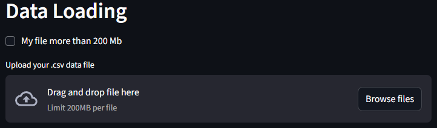
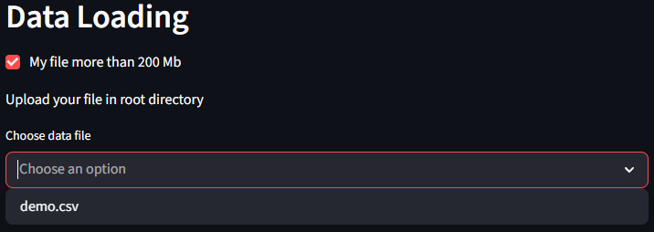
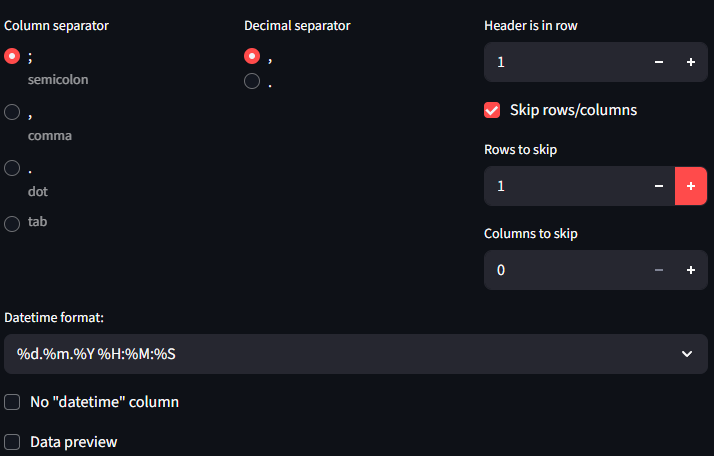
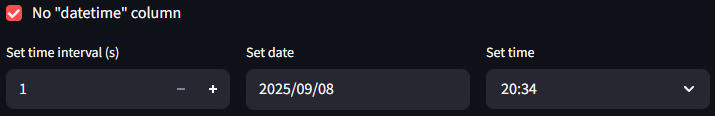
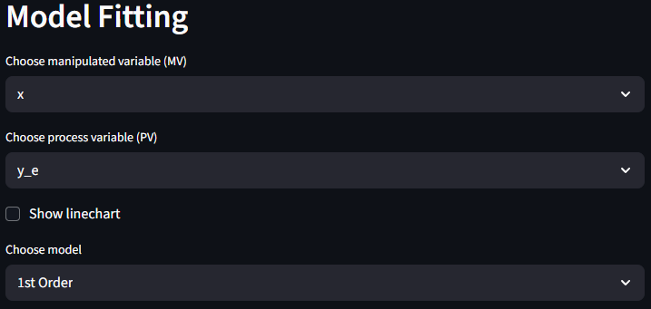
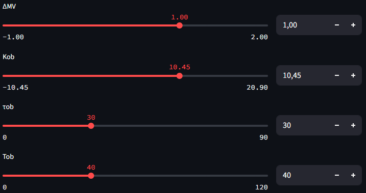
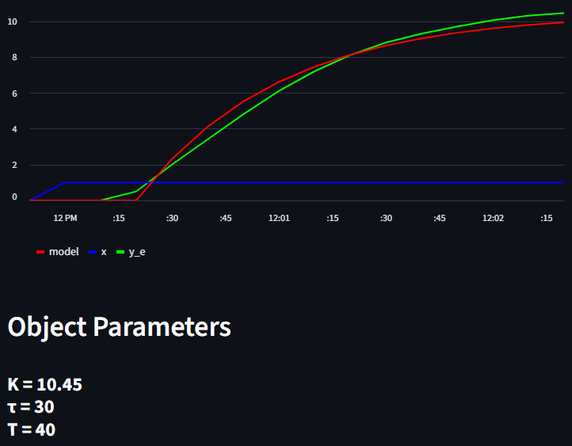
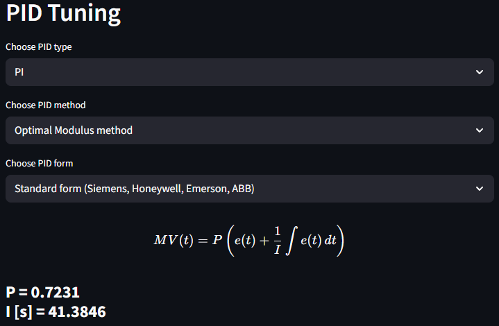

# PID Tuner

PID Tuner is an open-source tool for tuning PID controllers based on historical open-loop data, applying automatic 
control theory.  
Try the app right now on [streamlit](https://pid-tuner-nosterdream.streamlit.app/).

# Disclaimer
This software is provided "as is" for educational and informational purposes only.
The author makes no representations or warranties of any kind, express or implied, regarding the accuracy, reliability, 
or suitability of the PID tuning parameters or recommendations generated by this application.
Any use of this software, including applying its output to real-world systems or processes, is at your own risk.
The author shall not be held liable for any direct, indirect, incidental, or consequential damages, losses, or costs 
resulting from the use, misuse, or inability to use this software or its recommendations.

# Content
- [Requirements](#requirements)
- [Installation](#installation)
- [Usage](#usage)
  - [Overview](#overview)
  - [Data Loading](#data-loading)
  - [Model Fitting](#model-fitting)
  - [PID Tuning](#pid-tuning)
  - [References](#references)


# Requirements

- numpy==2.3.1
- pandas==2.3.0
- streamlit==1.46.1

# Installation

To run this project, you need to have Python 3.11 installed. Follow these steps to set up the environment:

1. Clone the repository:
    ```bash
    git clone https://github.com/nosterdream/pid-tuner.git
    cd pid-tuner
    ```

2. Create and activate a virtual environment:
    ```bash
    python -m venv venv
    source venv/bin/activate  # On Windows use `venv\Scripts\activate`
    ```

3. Install the required packages:
    ```bash
    pip install -r requirements.txt
    ```

# Usage
 
You can start the app by running either run_app.bat or run_app.py.  
This will launch a Streamlit server and open the default browser.  
Alternatively, you can start the app using the default Streamlit command:

```bash
streamlit run Home.py
```
## Overview

The task of synthesizing an automatic control system consists of selecting a control law and calculating its 
coefficients to ensure the required control quality while maintaining operability.  
The solution to this problem is not unique and depends on the chosen criterion for evaluating control quality.  

In engineering practice, a wide range of methods are used to calculate the tuning parameters of typical industrial 
controllers. Some of them are listed below:

1. Method based on the "optimal modulus" criterion [1]
2. Method based on the "aperiodic stability" criterion [1]
3. Coon's method [2]
4. Kopelovich's method [3]
5. Kopelovich–Sharkov method [4;5]
6. Method based on the "maximum stability" criterion [6]
7. Ziegler–Nichols method [7]
8. Huang method [7]
9. AMIGO method [8]
10. Lambda Tuning [8]
11. Skogestad's method [9]

---

## Data Loading
### The Data loading section helps you upload and preprocess your historical data.

You can upload files up to 200 MB each via drag-and-drop or by using the 'Browse files' button.  
This application supports only .csv files!



If your file is larger than 200 MB you can select the corresponding checkbox.
This action will scan the application's root directory and display a dropdown list of available .csv files.



After selecting the data file, you will see the data file settings.  
You can choose column separator:
- semicolon ;
- comma ,
- dot .
- tab   

and decimal separator:
- comma ,
- full stop .

Then you can choose the row that contains the headers of columns and optionally skip rows or columns if they are present 
in data.



Then choose a datetime format from dropdown list or select "No datetime column".
If selected, you can set the time interval and the start date and time.



If you want to preview your data before processing, check the "Data preview" box to display the first 5 rows.

---

## Model Fitting
### Model Fitting section helps you convert your historical data into a process model and obtain its parameters
First, you need to choose the Manipulated Variable (MV) and Process Variable (PV).
- **Manipulated variable** is valve position percentage % - variable you change to get response (process input).
- **Process variable** is the current measured process value - response from the input change (process output).

Tick "Show linechart" to check your data.

Then you can select the model order using dropdown list.



The program will automatically calculate all coefficients. You can then manually adjust them using sliders or 
by entering the required values.

ΔMV is a step input in your data. Kob, τob, Tob are object model coefficients.



After that, a chart with your process model and its parameters will be displayed below.



---

## PID Tuning
### PID Tuning section helps you obtain parameters for the PID controller

First, you need to choose PID type (PI/PID).  
Then choose one of the available methods from the dropdown list. The available methods depend on the selected model 
order and PID type.  
Finally, select the PID form you need. The corresponding equation will appear below to help ensure correct selection.  
PID parameters will appear below.



---

## References

1. Guretsky, H. (1974). *Analysis and Synthesis of Control Systems with Delay*. Moscow: Mashinostroenie.  
2. Shteinberg, Sh. E., et al. (1973). *Industrial Automatic Regulators*. Moscow: Energiya.  
3. Dubrovny, V. A., et al. (1981). *Handbook on Adjustment of Automatic Control and Regulation Devices* (Part 2). Kiev: Naukova Dumka.  
4. Sharkov, A. A., et al. (1990). *Automatic Control and Regulators in the Chemical Industry*. Moscow: Khimiya.  
5. Ginzburg, I. B. (1985). *Automatic Control and Regulators in the Building Materials Industry*. Leningrad: Stroyizdat.  
6. Zagriy, G. I., & Shublandze, A. M. (1988). *Synthesis of Control Systems Based on the Maximum Stability Degree Criterion*. Moscow: Energoizdat.  
7. O’Dwyer, A. (2009). *Handbook of PI and PID Controller Tuning Rules* (3rd ed.). London: Imperial College Press.  
8. Åström, K. J., & Hägglund, T. (2006). *Advanced PID Control*. ISA – The Instrumentation, Systems, and Automation Society.  
9. Skogestad, S. (2003). Simple analytic rules for model reduction and PID controller tuning. *Journal of Process Control*, 13, 291–309.

### Created by [NosterDream](https://github.com/nosterdream)
